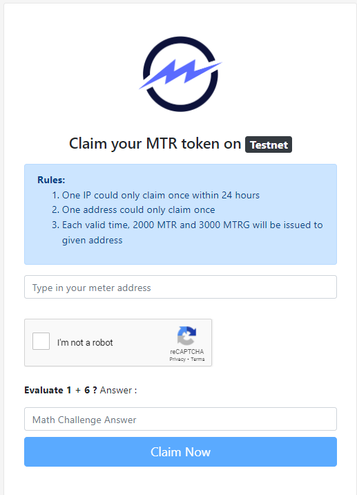

# NFT Quasar Testing:

To be able to use the app you must have the Meter network in your metamask wallet and MTR Token, if you already have it, you can already use the app, however if you don't have Meter. Do the following.

## Setup Test Network:

- Open your web browser and click on the Metamask add-on icon.

Go the “Networks” then click on “Add Network”. You will be asked to fill these fields :

- Network name
- New RPC URL
- Chain ID
- Currency Symbol (optional)
- Block Explorer URL (optional)

Meter Testnet:

Warringstakes Testnet Endpoints: 
- RPC: https://rpctest.meter.io
- ChainID: 83
- Currency Symbol: MTR
- Explorer: https://scan-warringstakes.meter.io

ERC20 System Interface:
- MTRG: 0x8a419ef4941355476cf04933e90bf3bbf2f73814
- MTR: 0x4cb6cef87d8cadf966b455e8bd58fff32aba49d1 

## Getting Test Tokens:

- Get Meter on your Wallet.

Head over to http://faucet-warringstakes.meter.io/ and claim MTR tokens.

And voila, now you can use your application without problem.